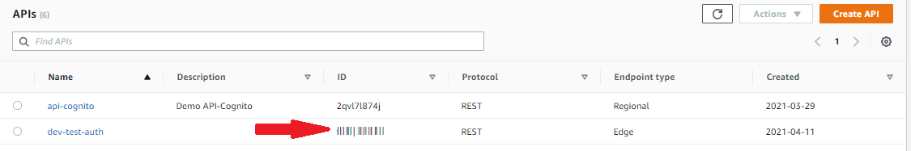

# Azure Serverless Authorizer
Serverless based AWS API Gateway Authorizer using Azure JWT.

This lambda function will receive the Azure JWT token and will:

1. Validate it
2. Extract audience
3. Extract scopes
4. Based on the extracted information, authorize or not authorize the request

This code is based on this repository:

https://github.com/RafPe/okta-serverless-authorizer

**All credits on RafPe, who designed this.**

# Use case

AWS API Gateway is being used to expose APIs that will be consumed for different web applications and consumers.
Users for those Web applications, are being authenticated and authorized using Microsoft Azure. This process is via OAUTH 2.0, and the result of the process is that the applications obtain an access token; this access token needs to be used by the application to consume APIs (exposed by AWS API Gateway). 
AWS API Gateway will receive the request from those different applications; the requests needs to come with the access token and the AWS API Gateway will have to validate it. In order to validate it, the API Gateway will use a lambda function that will contain the logic to validate the signature of the JWT token, and also retrieve information like:

* Scopes
* Audiences
* Expiration Date
* Issuer

If the token is valid and the scope is the expected one, then the lamda will return a succesful authorization, otherwise it will not authorize it.

The model is this one:


If you want to learn more about it, please take a look into AWS official documentation: https://aws.amazon.com/blogs/security/use-aws-lambda-authorizers-with-a-third-party-identity-provider-to-secure-amazon-api-gateway-rest-apis/

The Lambda Authorizer will return this:

```
{
  "Version": "2012-10-17",
  "Statement": [
    {
      "Action": [
        "execute-api:Invoke"
      ],
      "Effect": "Allow",
      "Resource": [
        "arn:aws:execute-api:us-east-2:130537859737:fe3qaenskh/ESTestInvoke-stage/GET/"
      ]
    }
  ]
}
```
That's the case of a valid authorization, that will let know the API Gateway to allow the user/client request. Otherwise, an Unauthorized message will be return.

## Files description

This project includes two lambda functions:
1. Authorizer function. This one represent the lambda with the token validation and authorization logic. Source coude is in auth/main.go
2. Func1. This one is a sample lamda function, that represent the resource that the application, ultimately, wants to call. In order to access it, you need to have a valid JWT token

All the assets can be deployed using sls (Serverlss) and therefore there are two relevant files:
* serverless.env.yml
* serverless.yml

The second one describe what we are going to create in AWS.

## Deployment pre-requisites

Pre-requisites are:

1. Serverless (sls) CLI
2. Go 
3. npm

To download and install Serverless (sls) CLI:
https://www.serverless.com/framework/docs/getting-started/

To download and install go:
https://www.tecmint.com/install-go-in-linux/

To download and instal npm:
https://www.npmjs.com/get-npm

You need to build both of the functions, which is decribed in the next section.

## Build 

To build both functions, execute:

* go build -ldflags="-s -w" -o bin/func1 func1/main.go
* go build -ldflags="-s -w" -o bin/auth auth/main.go

## Deploy your functions. Create the stack

You need first to include the public key of the JWT token into the serverless.env.yml file. 
In order to get this, you can use jwt.io to read the token and then copy and paste it into the file:


Just keep in mind that you need to use some change of line characters, for example:

```
AZURE_PUBLIC_KEY: "-----BEGIN RSA PUBLIC KEY-----\nMIjANBgkqhkiG9w0BAQEFAAOCAQ8AMIIBCgKCAQEAlGdfGiqSt4QI57Z\npTk2RJ7MbGd8/hGp/zSbF7Ofz75TUbHaE3YCl/0WjCVszk4V+/VaJq5SWWZ\n6F7Q/ifbHP9/j4rL8VMDl7ve4MeuxyQviYuybRp3nsGNOWxuVxpnjC6ZDGbLuech\n2BCBCMFRmPc89p3sTNYlYfCn5Hy5NRKfCgqI/R6AuVBU626dcQVn0R42/wm8esFP\na/Js0ez8Fl1yUktSe/SMQcVM0V9fpZpsoMZ0HdpGQ3YgquIlAIXt2yhO1iAiMnA4\nzTsuZ+eQLfhNbuANqEAGS1b0bPvTnkg7eYifeptdJHyHv9wWtcDsd+vMUlS7iJow\n2QIDB\n-----END RSA PUBLIC KEY-----"
```

Since we are using sls, you just need to execute this:

sls deploy -s dev --verbose

## Validation

In order to validate it, you need to get obtain an access token from Azure. For example:

```
curl --location --request GET 'https://login.microsoftonline.com/spsolutions.com.mx/oauth2/v2.0/token' \
--header 'Content-Type: application/x-www-form-urlencoded' \
--header 'Cookie: fpc=ApwAasdfadw5K4-whGhirlkJjfxWN2xWG8AQAAABqnBtgOAAAA; stsservicecookie=estsfd; x-ms-gateway-slice=estsfd' \
--data-urlencode 'grant_type=password' \
--data-urlencode 'client_id=34331de76-3432436-42349ae-97bc-6gadfafasdfse1e' \
--data-urlencode 'scope=myScope' \
--data-urlencode 'client_secret=Jadfasfsafasdafasf' \
--data-urlencode 'username=your_user' \
--data-urlencode 'password=your password'
```
This will return a JWT token.

Once with the token, you can get access to the Func1 via AWS API Gateway:

```
curl --location --request GET 'https://e3qaeh.execute-api.us-east-2.amazonaws.com/dev/hello' \
--header 'Authorization: Bearer your_access_token'
```
Replace *your_access_token* with the previously obtained access token.

If you are wondering, from were I get the endpoint  (e3qaeh.execute-api.us-east-2.amazonaws.com), in specif *e3qaeh*, go to the API Gateway section from your AWS console:



## Scopes validation and authorization

In our serverless.env.yml we've incorporated a list of scopes:
```
  SCOPES: "scope1 scope2 scope3"
```

Those scopes are a sample list, you need to incorporate your own scopes. 
In order to validate them, in file auth/main.go , at lines 97, 98, 99 there is an explanation on how to read the scopes, and then you will have to validate them
with the ones that the token include, and with that authorize or not.


## Destroy the stack

If you want to delete everything that was created, simple execute:
sls remove -s dev --verbose

